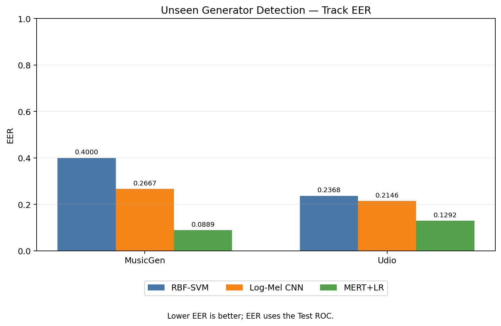
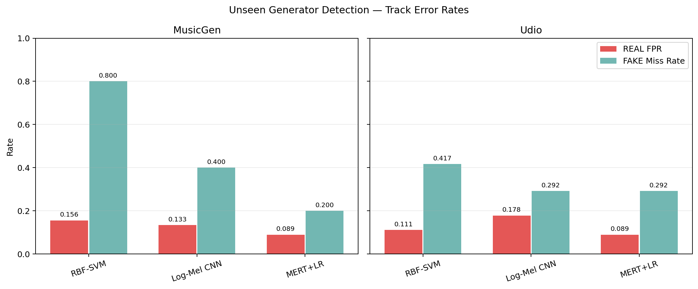
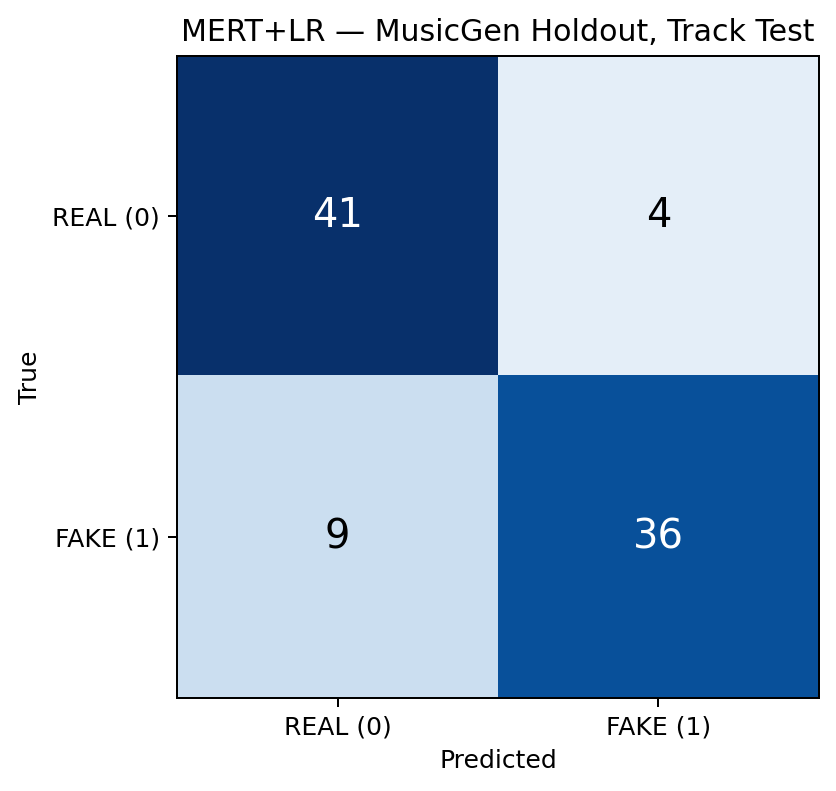
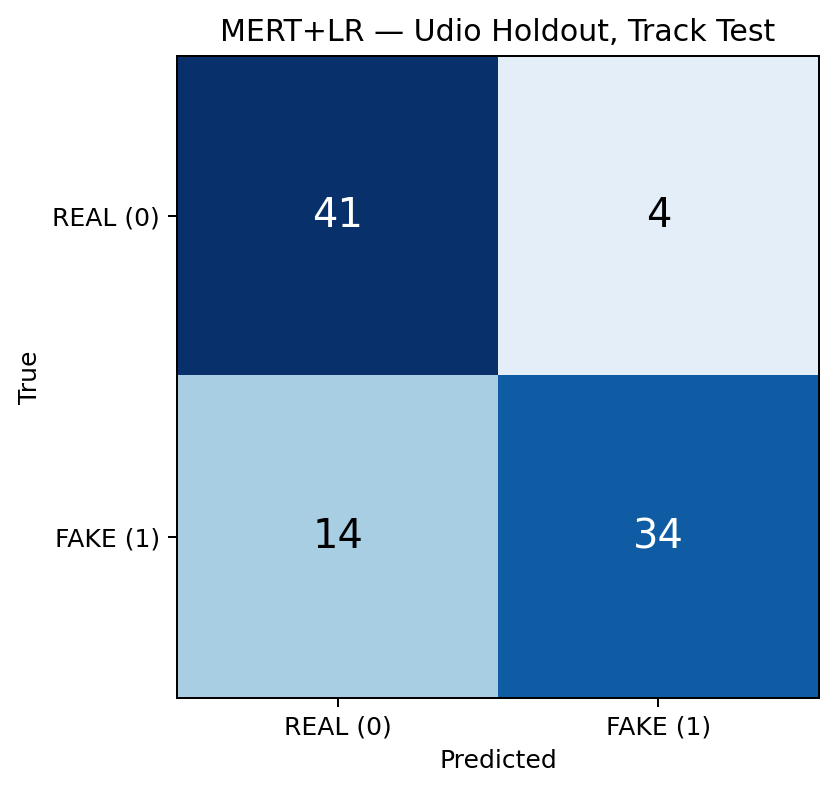
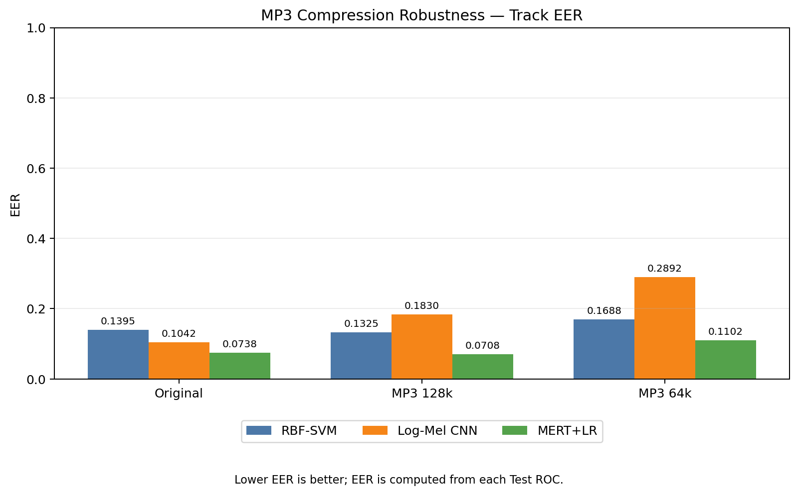
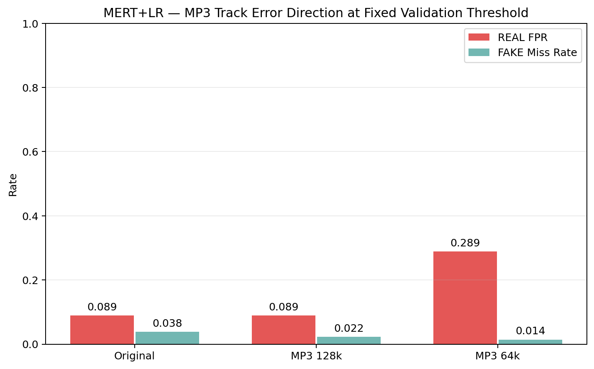

# 22번 실험 보고서: Frozen MERT의 미노출 생성기 탐지와 MP3 압축 평가

작성일: 2026-09-21
분석 기준: [22번 노트북](../notebooks/22_mert_unseen_generator.ipynb)의 최초 저장 결과

## 1. 연구 질문과 핵심 결과

**연구 질문:** MusicGen 또는 Udio의 FAKE 음악을 Train과 Validation에서 제거한 뒤, 나머지 생성기의 음악으로 학습한 탐지기가 해당 생성기의 Test 음악을 FAKE로 구분할 수 있는가?

Frozen MERT 표현과 로지스틱 회귀(MERT+LR)를 사용한 결과, Track ROC-AUC는 **MusicGen 0.9407**, **Udio 0.9181**이었다. 같은 Test 곡을 평가한 기존 RBF-SVM·Log-Mel CNN 결과보다 두 조건 모두 AUC가 높았다. Validation에서 고정한 임계값을 적용하면 MusicGen FAKE 45곡 중 9곡, Udio FAKE 48곡 중 14곡을 REAL로 놓쳤다.

이 결과는 **MusicGen과 Udio 두 holdout 조건**에 대한 관찰이다. 모든 새로운 생성기에 대한 일반화 성능이나 모델 간 차이의 통계적 유의성을 입증하지는 않는다.

22번 노트북에는 별도의 **MP3 압축 강건성 분석**도 추가했다. 이 분석은 holdout 분류기가 아니라 기존 전체 생성기 binary MERT 모델을 고정하여, 같은 Test 539곡의 원본·128 kbps·64 kbps 조건을 비교한다. MERT Track AUC는 각각 **0.9845, 0.9851, 0.9605**였다.

## 2. 실험 설계

### 2.1 데이터 분할과 holdout

기존 [10초 segment manifest](../data/metadata/segment_manifest_10s.csv)의 Train·Validation·Test 분할을 그대로 사용했다. 하나의 원본 음악을 뜻하는 `original_audio`는 한 split에만 속한다. 그룹 수는 Train 207개, Validation 44개, Test 45개이며 split 간 중복은 없다. `REAL=0`, `FAKE=1`이다.

각 생성기에 대해 별도 실험을 수행했다.

| 단계 | 포함하는 데이터 |
|---|---|
| Train | 기존 Train REAL 전체 + 대상 생성기를 제외한 Train FAKE |
| Validation | 기존 Validation REAL 전체 + 대상 생성기를 제외한 Validation FAKE |
| Test | 기존 Test REAL 전체 + **대상 생성기의 Test FAKE만** |

필터 적용 전 전체 split의 Track 수는 Train REAL/FAKE **207/2,185**, Validation **44/483**, Test **45/494**였다. 필터 적용 후 개수는 다음과 같다. 각 칸은 **REAL / FAKE** 순서다.

| Holdout | Split | Track | 10초 Segment | `original_audio` 그룹 |
|---|---|---:|---:|---:|
| MusicGen | Train | 207 / 1,980 | 621 / 5,731 | 207 |
| MusicGen | Validation | 44 / 440 | 132 / 1,277 | 44 |
| MusicGen | Test | 45 / 45 | 135 / 135 | 45 |
| Udio | Train | 207 / 1,981 | 621 / 5,734 | 207 |
| Udio | Validation | 44 / 435 | 132 / 1,262 | 44 |
| Udio | Test | 45 / 48 | 135 / 144 | 45 |

MusicGen FAKE는 Train에서 205 Track·615 Segment, Validation에서 43 Track·129 Segment가 제거됐다. Udio FAKE는 각각 204 Track·612 Segment, 48 Track·144 Segment가 제거됐다. 필터링된 Train·Validation의 대상 생성기 FAKE 수는 두 실험 모두 **0**이다. Test의 90/93 Track이 90/93개의 독립된 원곡을 뜻하는 것은 아니다. Test의 `original_audio` 그룹은 두 실험 모두 45개다.

### 2.2 MERT 표현과 분류기

설정의 기준은 기존 최적화 binary 실험의 선택 체크포인트 `mert_best.joblib`이다. 체크포인트 파일은 제출 패키지의 용량을 줄이기 위해 포함하지 않았다. 과거 17번 실험의 layer 9 결과와 구분하여, 해당 체크포인트에 저장된 다음 설정을 읽었다.

| 항목 | 적용한 설정 |
|---|---|
| MERT | `m-a-p/MERT-v1-95M`, 고정된 인코더 |
| 오디오와 표현 | 24 kHz mono, 10초 segment, 유효 hidden frame 평균 풀링 |
| 캐시 모양 | `[segment, 13개 표현 level, 768차원]` |
| 선택 표현 | **layer 4** (0부터 시작하는 번호) |
| 분류기 | `StandardScaler` + `LogisticRegression` |
| LR 설정 | **C=0.01**, `solver=lbfgs`, `class_weight=balanced`, `max_iter=3000`, `random_state=42` |

Train·Validation 8,505 Segment와 Test 1,572 Segment의 저장된 valid-frame MERT 캐시를 재사용했다. MERT 인코더를 다시 실행하거나 미세조정하지 않았다. **MusicGen과 Udio마다 scaler와 LR 분류기를 새로 만들고**, scaler의 평균·표준편차와 LR 가중치는 해당 holdout의 필터링된 Train에서만 학습했다. Validation과 Test에는 `transform`과 예측만 적용했다.

### 2.3 Track 점수, 임계값, 지표

각 10초 Segment의 점수는 LR의 **FAKE(클래스 1) 예측 확률**이다. 한 Track의 점수는 그 Track에 속한 Segment 점수의 산술평균이다.

```text
Track FAKE 점수 = 해당 Track의 Segment FAKE 점수 합 / Segment 수
```

각 holdout에서 대상 생성기를 제거한 **Validation Track ROC**를 만들고, 유한한 후보 임계값 중 `|FPR − FNR|`이 최소인 값을 선택했다. `FNR = 1 − TPR`이다. 이 임계값을 Test에 그대로 적용해 Balanced Accuracy, Macro-F1, REAL FPR, FAKE Miss Rate, 혼동행렬을 계산했다.

Test ROC-AUC는 점수의 순위 분리력을 나타낸다. **보고서의 Test EER은 Test ROC에서 별도로 계산한 지표**다. 이산 ROC 점 중 `|FPR − FNR|`이 가장 작은 지점의 `(FPR + FNR) / 2`를 EER 근삿값으로 기록한다. 그때의 Test 임계값을 Test 판정에 다시 사용하지 않았으므로, Test EER과 Validation 임계값을 적용한 오류율은 서로 다른 계산을 요약한다.

기존 RBF-SVM과 Log-Mel CNN의 저장 결과를 불러와 비교했으며, 세 모델의 Test Track ID가 완전히 같은지도 예측 파일로 확인했다. 제출본에는 최종 비교값을 [세 모델 비교표](../results/mert_unseen_generator/mert_unseen_comparison.csv)로 정리했다.

## 3. Track-level Test 결과

### 3.1 세 모델 비교

| Holdout | 모델 | ROC-AUC ↑ | EER ↓ | Balanced Acc. ↑ | Macro-F1 ↑ | REAL FPR ↓ | FAKE Miss ↓ |
|---|---|---:|---:|---:|---:|---:|---:|
| MusicGen | RBF-SVM | 0.6123 | 0.4000 | 0.5222 | 0.4669 | 0.1556 | 0.8000 |
| MusicGen | Log-Mel CNN | 0.8681 | 0.2667 | 0.7333 | 0.7285 | 0.1333 | 0.4000 |
| MusicGen | **MERT+LR** | **0.9407** | **0.0889** | **0.8556** | **0.8551** | **0.0889** | **0.2000** |
| Udio | RBF-SVM | 0.8542 | 0.2368 | 0.7361 | 0.7266 | 0.1111 | 0.4167 |
| Udio | Log-Mel CNN | 0.8227 | 0.2146 | 0.7653 | 0.7632 | 0.1778 | **0.2917** |
| Udio | **MERT+LR** | **0.9181** | **0.1292** | **0.8097** | **0.8053** | **0.0889** | **0.2917** |

MusicGen에서 MERT+LR의 AUC는 CNN보다 **0.0726**, SVM보다 **0.3284** 높았다. Udio에서는 CNN보다 **0.0954**, SVM보다 **0.0639** 높았다. 이는 이 Test 집합에서 관찰한 **AUC 값의 차이**이며, 성능이 몇 퍼센트 개선됐다는 뜻이나 통계적 유의성 주장은 아니다.




### 3.2 Validation 임계값과 오류 방향

| Holdout | MERT Validation Track 임계값 | Test TN | FP | FN | TP | REAL 오탐 | FAKE 미탐 |
|---|---:|---:|---:|---:|---:|---:|---:|
| MusicGen | 0.583849 | 41 | 4 | 9 | 36 | 4/45 = 8.89% | 9/45 = 20.00% |
| Udio | 0.589972 | 41 | 4 | 14 | 34 | 4/45 = 8.89% | 14/48 = 29.17% |

`TN/FP/FN/TP`는 순서대로 REAL 정답, REAL을 FAKE로 오탐, FAKE를 REAL로 미탐, FAKE 정답이다. Udio에서 MERT와 CNN의 FAKE 미탐은 **둘 다 14/48곡**이다. 다만 REAL 오탐은 MERT **4/45곡**, CNN **8/45곡**이었다. 세 모델의 점수 척도는 다르므로 임계값 숫자 자체를 모델 간 우열로 비교하지 않는다.



| MusicGen MERT 혼동행렬 | Udio MERT 혼동행렬 |
|---|---|
|  |  |

### 3.3 Segment 결과와 Track 평균의 효과

| Holdout | 평가 단위 | ROC-AUC | EER | Balanced Accuracy |
|---|---|---:|---:|---:|
| MusicGen | Segment | 0.9143 | 0.1630 | 0.8111 |
| MusicGen | Track | 0.9407 | 0.0889 | 0.8556 |
| Udio | Segment | 0.8862 | 0.2007 | 0.7859 |
| Udio | Track | 0.9181 | 0.1292 | 0.8097 |

두 holdout에서 Track 평균 후 AUC가 더 높고 EER이 더 낮았다. Track과 Segment는 평가 단위가 다르므로, 이 차이를 개별 모델 변경의 효과로 해석하지 않는다.

## 4. 검증 결과와 해석 범위

노트북의 **16개 QC 항목이 모두 통과**해 `MERT UNSEEN GENERATOR QC PASS`가 출력됐다. 확인 항목에는 캐시 재사용, 고정된 MERT 인코더, 선택 layer·C 일치, Train 전용 scaler 학습, 대상 생성기 Train·Validation FAKE 0개, 기존 `original_audio` split 유지, Segment 점수 평균, Validation 임계값 사용, Test threshold 재선택 없음, REAL/FAKE 라벨, 유한한 수치 결과, 기존 파일 덮어쓰기 방지가 포함된다. 저장된 Track 예측에서 AUC와 혼동행렬을 재계산해 결과 CSV와 일치함도 확인했다.

2026-09-21 재실행에서도 최초 결과와 동일한 MERT 지표와 데이터 수가 기록됐다. 중복 실행 폴더는 제출 패키지에서 제외했다.

해석에는 다음 범위를 적용해야 한다.

1. **고정 설정 전이 실험이다.** Layer 4와 C=0.01은 이번 holdout마다 다시 고른 값이 아니라 기존 *전체 생성기 binary 실험*에서 이미 선택된 값이다. 그 기존 설정 선택 과정에는 MusicGen·Udio의 Train/Validation 자료가 포함됐다. 이번 실험에서는 **holdout별 scaler·LR 가중치와 임계값**을 대상 생성기 없이 새로 학습·선택했지만, 설정 선택까지 생성기 정보와 완전히 독립적인 검증이라고 말할 수는 없다.
2. **평가 대상은 생성기 두 종이다.** Test에는 MusicGen 45 FAKE Track, Udio 48 FAKE Track이 있고 두 조건 모두 45개의 `original_audio` 그룹을 사용한다. 다른 생성기나 배포 환경으로 결과를 확장하려면 별도 검증이 필요하다.
3. **불확실성 추정은 수행하지 않았다.** 신뢰구간이나 유의성 검정을 계산하지 않았으므로 모델 간 수치 차이를 확정적인 우열로 일반화하지 않는다.
4. **Clean vs Unseen 그림은 생성하지 않았다.** 저장된 과거 MERT clean 결과는 layer 9와 다른 패딩·풀링 방식의 실험이다. 현재 layer 4 valid-frame 설정의 비교 가능한 *생성기별* clean AUC 산출물이 없어 세 모델의 Clean→Unseen 변화를 한 그림에 넣지 않았다.

## 5. 추가 분석: MP3 압축 강건성

### 5.1 MP3 실험의 범위와 방법

이 절은 앞의 MusicGen/Udio holdout과 **다른 실험**이다. 기존 Test의 **539 Track(REAL 45, FAKE 494)**과 **1,572 Segment(REAL 135, FAKE 1,437)**를 모두 사용한다. `original`은 데이터셋에 저장된 원래 파일을 뜻하며 무압축 오디오를 뜻하지 않는다. `mp3_128`, `mp3_64`는 12번 실험에서 같은 곡을 128/64 kbps로 재인코딩한 자료다. 개별 전사 기록은 제출본에서 제외했다.

세 조건 모두 [MP3 실험용 MERT 캐시](../data/processed/model_robustness/mp3/mert)에서 같은 Test Segment ID와 순서를 사용한다. MP3 파일을 곡 처음부터 디코딩하고 원래 Segment 시작점에서 자른 뒤, 패딩 없이 MERT 유효 hidden frame의 평균을 저장한 캐시다. 압축 전후 변화량은 같은 방식으로 추출된 **MP3 실험용 `clean` 캐시**를 기준으로 계산했다. 이 캐시는 일반 binary Test 캐시와 디코딩 방식이 달라 값이 미세하게 다르다.

전체 생성기로 학습된 기존 최적화 binary 체크포인트의 **layer 4, scaler, LR(C=0.01), Segment 임계값 0.568567, Track 임계값 0.588751**을 세 조건에 그대로 적용했다. MP3 자료로 모델이나 임계값을 다시 학습하지 않았다. Test EER은 각 조건의 ROC에서 별도로 계산했고, 혼동행렬과 오류율은 고정된 Validation 임계값을 사용했다.

### 5.2 전체 Test Track 결과

| 조건 | 모델 | ROC-AUC ↑ | EER ↓ | Balanced Acc. ↑ | REAL FPR ↓ | FAKE Miss ↓ |
|---|---|---:|---:|---:|---:|---:|
| Original | RBF-SVM | 0.9644 | 0.1395 | 0.8696 | 0.1556 | 0.1053 |
| Original | Log-Mel CNN | 0.9772 | 0.1042 | 0.9111 | 0.1333 | 0.0445 |
| Original | **MERT+LR** | **0.9845** | **0.0738** | **0.9363** | **0.0889** | **0.0385** |
| MP3 128 kbps | RBF-SVM | 0.9536 | 0.1325 | 0.8676 | 0.1778 | 0.0870 |
| MP3 128 kbps | Log-Mel CNN | 0.8954 | 0.1830 | 0.7626 | 0.4444 | 0.0304 |
| MP3 128 kbps | **MERT+LR** | **0.9851** | **0.0708** | **0.9444** | **0.0889** | **0.0223** |
| MP3 64 kbps | RBF-SVM | 0.9062 | 0.1688 | 0.8494 | 0.2000 | 0.1012 |
| MP3 64 kbps | Log-Mel CNN | 0.8256 | 0.2892 | 0.7179 | 0.2444 | 0.3198 |
| MP3 64 kbps | **MERT+LR** | **0.9605** | **0.1102** | 0.8485 | 0.2889 | **0.0142** |

MERT의 Original 대비 Track AUC 변화량(`Original − MP3`)은 128 kbps에서 **−0.0006**, 64 kbps에서 **+0.0240**이었다. 같은 계산으로 SVM의 64 kbps AUC 하락은 **0.0583**, CNN은 **0.1516**이다. 128 kbps에서 MERT AUC가 소폭 오른 사실만으로 압축이 탐지를 개선한다고 결론 내릴 수는 없다. 세 모델은 같은 Test 곡을 평가했지만 입력 표현과 체크포인트가 다르므로, 모델 간 차이는 이 실험 조건의 관찰값으로 읽는다.




고정된 Track 임계값 **0.588751** 아래 MERT의 오류 방향은 다음과 같다.

| 조건 | TN | FP | FN | TP | REAL 오탐 | FAKE 미탐 |
|---|---:|---:|---:|---:|---:|---:|
| Original | 41 | 4 | 19 | 475 | 4/45 = 8.89% | 19/494 = 3.85% |
| MP3 128 kbps | 41 | 4 | 11 | 483 | 4/45 = 8.89% | 11/494 = 2.23% |
| MP3 64 kbps | 32 | 13 | 7 | 487 | 13/45 = 28.89% | 7/494 = 1.42% |

64 kbps에서는 AUC와 Balanced Accuracy가 내려갔고, 정상 음악의 오탐이 증가했다. 동시에 FAKE 미탐은 줄었다. 따라서 **오탐과 미탐의 방향을 함께** 봐야 하며, FAKE 미탐률 하나만으로 압축 강건성을 판단하면 안 된다.



MP3 추가 절의 **QC 10개 항목이 모두 통과**해 `MERT MP3 QC PASS`가 출력됐다. 세 캐시의 완료 상태·모델 revision·manifest 및 전사 기록 해시·동일 Test ID·고정 임계값·유한한 지표를 확인했다. 저장된 MERT 가중치만 사용했으며 새로운 MERT 추출이나 LR 학습은 수행하지 않았다.

## 6. 재현 파일

| 파일 | 내용 |
|---|---|
| [22번 노트북](../notebooks/22_mert_unseen_generator.ipynb) | 실행 코드, 한국어 단계별 설명, 셀별 결과 요약 |
| [데이터 수](../results/mert_unseen_generator/mert_unseen_dataset_counts.csv) | holdout 필터 전·후 Track·Segment·원곡 그룹 수 |
| [세 모델 비교](../results/mert_unseen_generator/mert_unseen_comparison.csv) | 동일 Test Track에 대한 SVM·CNN·MERT 결과 |
| [세 모델 MP3 비교](../results/mert_mp3_robustness/mert_mp3_track_comparison.csv) | Original·128/64 kbps의 Track 지표와 SVM/CNN 비교 |
| [MP3 AUC 변화량](../results/mert_mp3_robustness/mert_mp3_auc_change.csv) | 같은 모델의 Original 대비 압축 조건 변화량 |
| [제외 산출물 목록](../summary/artifacts_not_included.csv) | 체크포인트, 개별 예측값, 중복 실행 폴더 등 제출본에서 뺀 항목과 이유 |

노트북을 처음부터 다시 실행하면 기존 결과를 덮어쓰지 않고 각 결과 폴더의 `runs/` 아래 새 실행 폴더를 만든다. 기존 [MERT 확장 이전 보고서](FINAL_REPORT_pre_MERT_extensions.md)의 미노출 생성기·MP3 표는 22번의 MERT 추가 이전 결과를 담고 있으며, 이 문서는 그 후속 분석이다.
