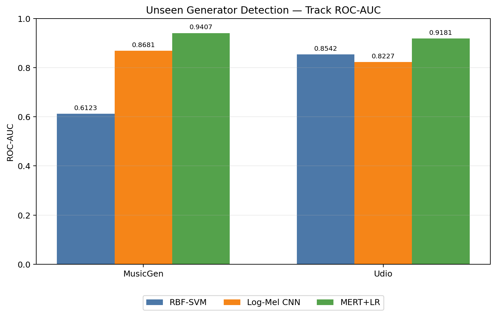
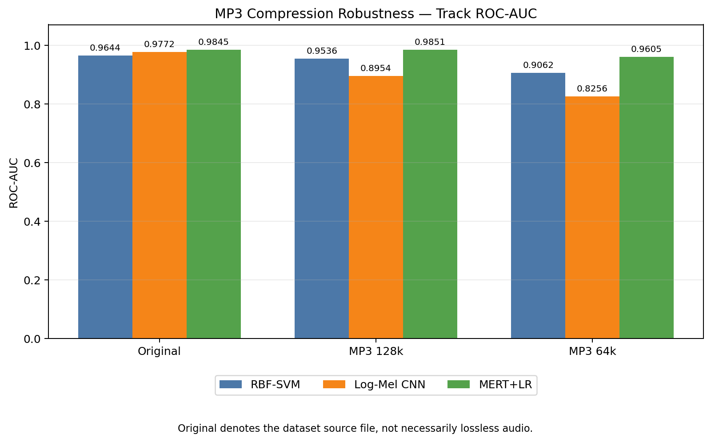
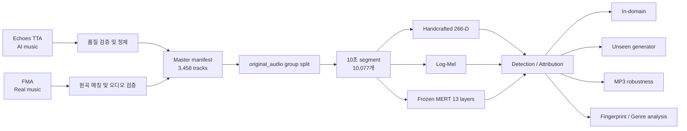

# Audio Deepfake Detection & Generator Fingerprint Analysis

AI 생성 음악을 실제 음악과 구분하고, 학습에서 보지 못한 생성기와 MP3 압축 환경에서의 강건성, 생성기별 음향 fingerprint까지 분석한 프로젝트입니다.

이 저장소는 Echoes TTA의 AI 생성 음악과 대응되는 FMA 실제 음악을 정제한 뒤, 동일 원곡이 Train/Validation/Test에 섞이지 않도록 `original_audio` 단위로 분할합니다. Handcrafted feature, Log-Mel CNN, frozen MERT 표현을 동일한 평가 원칙 아래 비교합니다.

> 분석 완료일: 2026-09-22
> 상세 결과: [최종 분석 보고서](docs/FINAL_REPORT.md) · [발표 이후 피드백](docs/23_post_presentation_feedback.md) · [MERT 강건성 추가 보고서](docs/22_mert_unseen_generator_report.md) · [변경사항](CHANGELOG.md)

## 핵심 결과

### 1. In-domain AI 음악 탐지 — Track Test

| 모델 | 표현 | ROC-AUC | EER | Balanced Accuracy |
|---|---|---:|---:|---:|
| RBF-SVM | 266-D handcrafted | 0.9644 | 0.1395 | 0.8696 |
| Log-Mel CNN | 128-bin Log-Mel | 0.9772 | 0.1042 | 0.9111 |
| **MERT95M + LR** | Frozen MERT layer | **0.9872** | **0.0455** | **0.9363** |

MERT가 clean/in-domain 성능에서 가장 우수했습니다. 또한 세 모델 모두 10초 segment 결과보다 곡 단위 평균인 Track aggregation에서 더 안정적인 성능을 보였습니다.


### 2. Unseen-generator 일반화 — Track ROC-AUC

| Holdout generator | RBF-SVM | Log-Mel CNN | MERT+LR |
|---|---:|---:|---:|
| MusicGen | 0.6123 | 0.8681 | **0.9407** |
| Udio | 0.8542 | 0.8227 | **0.9181** |

MERT가 두 holdout에서 가장 높은 AUC를 보였습니다. 다만 평가 대상이 MusicGen과 Udio 두 종류뿐이므로 다른 생성기까지 같은 결과라고 확대 해석할 수는 없습니다.



### 3. MP3 codec shift — Track ROC-AUC

| 모델 | Original | MP3 128 kbps | MP3 64 kbps |
|---|---:|---:|---:|
| RBF-SVM | 0.9644 | 0.9536 | 0.9062 |
| Log-Mel CNN | 0.9772 | 0.8954 | 0.8256 |
| MERT+LR | **0.9845** | **0.9851** | **0.9605** |

MERT의 64 kbps AUC 하락은 0.0240으로 세 모델 중 가장 작았습니다. 다만 같은 조건에서 REAL 오탐률은 0.0889에서 0.2889로 증가했으므로 AUC와 오류 방향을 함께 봐야 합니다. MP3 표의 MERT는 layer 4 valid-frame/full-decode cache를 사용해 in-domain layer 9 결과와 Original AUC가 다릅니다.



### 4. 12-way generator attribution

| 표현 / 통제 조건 | Test Accuracy | Macro-F1 | Macro OVR AUC |
|---|---:|---:|---:|
| Handcrafted + RBF-SVM, Full | 0.8846 | 0.8840 | 0.9765 |
| MERT95M + LR, Full | **0.9393** | **0.9384** | **0.9959** |
| Handcrafted + RBF-SVM, Strict balanced | 0.7544 | 0.7447 | 0.9534 |
| MERT95M + LR, Strict balanced | **0.8991** | **0.8980** | **0.9920** |

동일 source set, generator별 동일 track 수, `source × generator`당 정확히 한 track으로 통제한 뒤에도 chance level 8.33%보다 훨씬 높은 분류 성능이 유지되었습니다. 이는 생성기별 음향 signature가 source coverage 차이만으로 설명되지 않음을 보여줍니다.

## 분석 파이프라인



## 데이터 구성

| 단계 | 결과 |
|---|---:|
| Echoes 전체 manifest | 4,468 rows |
| 정제된 TTA FAKE | 3,162 tracks |
| 매칭·검증된 FMA REAL | 296 tracks |
| Master manifest | 3,458 tracks |
| 고유 `original_audio` | 296 groups |
| 10초 segment | 10,077 |
| Segment split | Train 6,967 / Val 1,538 / Test 1,572 |

동일한 원곡에서 여러 생성기의 음악이 만들어지는 구조이므로 파일 단위 random split은 누수를 일으킬 수 있습니다. 모든 실험은 `original_audio` group split을 유지하고, scaler·차원축소·모델은 Train에서만 학습하며, threshold와 layer 선택은 Validation에서만 수행했습니다.

## 노트북 실행 순서

| 구간 | 노트북 | 역할 |
|---|---|---|
| 데이터 | `01`–`08` | 품질 검증, FMA 매칭, group split, EDA, segment 및 feature 생성 |
| 기본 탐지 | `09`–`10` | LR/RBF-SVM baseline 및 subgroup 분석 |
| 강건성 | `11`–`12` | Handcrafted unseen-generator 및 MP3 robustness |
| CNN | `13`–`16` | Log-Mel CNN, unseen/MP3 평가, 1차 통합 분석 |
| MERT | `17_mert_frozen_baseline_v2.ipynb`, `22_mert_unseen_generator.ipynb` | Frozen MERT baseline, unseen-generator 및 MP3 평가 |
| Attribution | `18_generator_attribution_handcrafted_v3.ipynb`, `18B_...`, `19_...` | Full 및 strict-balanced 12-way 생성기 분류 |
| 해석 | `20_generator_fingerprint_pca_umap.ipynb`, `20_..._v2.ipynb`, `21_...` | PCA/UMAP, silhouette, 장르 및 음향 feature 분석 |
| 후속 검증 | `23_post_presentation_feedback_single_track_inference.ipynb` | 단일 MP3 2곡 입력, 모델별 AI 생성 판정 및 곡 단위 aggregation |

위 표에 적힌 파일이 각 단계의 실행본입니다. 20번 PCA/UMAP 분석은 주 실행본과 v2 보존 사본을 모두 유지했습니다.

## 저장소 구조

```text
.
├── 01_...ipynb ~ 22_...ipynb    # 순차 분석 노트북 24개
├── src/                          # FMA 다운로드·추출 보조 스크립트
├── results/                      # 재현 가능한 표, 예측, 그림
│   ├── baseline/
│   ├── cnn/
│   ├── mert/
│   ├── mert_unseen_generator/
│   ├── mert_mp3_robustness/
│   ├── generator_attribution/
│   ├── generator_fingerprint_visualization/
│   └── generator_genre_feature_analysis/
└── docs/FINAL_REPORT.md          # 방법·결과·한계 상세 보고서
```

## 제출용 패키지

[`4조_DL프로젝트_(AI생성음악 탐지)`](<4조_DL프로젝트_(AI생성음악 탐지)/>) 폴더에는 전처리 데이터, 노트북, 통합 요약 CSV, 핵심 결과표, 대표 그림과 발표자료를 함께 정리했습니다. 원본 오디오와 수 GB 규모의 재생성 가능한 cache는 용량 및 재배포 조건 때문에 제외했습니다.

## 실행 환경

최종 실행 환경은 macOS/Apple Silicon, Python 3.13.9입니다. 주요 패키지는 PyTorch, scikit-learn, librosa, pandas, NumPy, matplotlib/seaborn, UMAP입니다.

MERT 노트북은 원격 모델 코드와의 호환성을 위해 아래 버전을 사용합니다.

```bash
python -m pip install "transformers==4.47.1" "tokenizers==0.21.0"
```

원본 오디오, 대용량 Log-Mel/MERT cache, checkpoint는 용량 및 배포 조건 때문에 Git에서 제외됩니다. 저장소에는 분석 코드와 compact result artifact를 보존합니다.

## 최종 결론

- Frozen MERT 표현은 in-domain 탐지와 generator attribution 모두에서 가장 강했습니다.
- Log-Mel CNN은 clean detection에는 강하지만 MP3 codec shift에 더 민감했습니다.
- MERT는 MusicGen·Udio holdout에서 가장 높은 AUC를 보였지만, 평가 범위는 두 생성기로 제한됩니다.
- MERT는 MP3 64 kbps에서 AUC 하락이 가장 작았지만 REAL 오탐률은 증가했습니다.
- 엄격한 source/class 통제 이후에도 생성기 attribution이 가능해 generator fingerprint의 존재를 지지합니다.
- PCA/UMAP과 silhouette만으로는 이 구조가 명확한 compact cluster로 나타나지 않았습니다. fingerprint는 고차원·비선형 결정 경계에 분산되어 있을 가능성이 큽니다.
- 장르와 생성기 signature는 상호작용하며, RMS·flatness·MFCC 일부가 반복적으로 높은 구분력을 보였습니다.

해석 범위와 제한사항은 [최종 분석 보고서](docs/FINAL_REPORT.md)에 정리했습니다.
